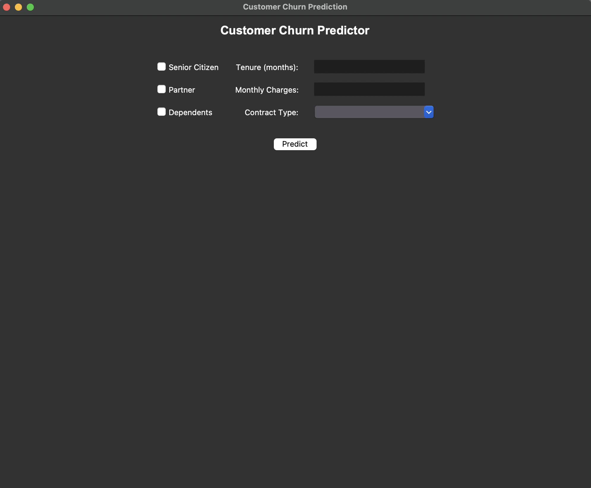
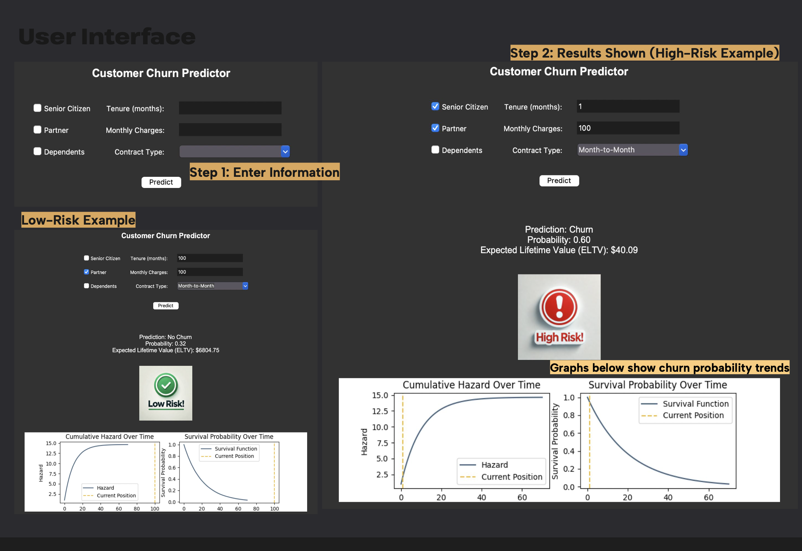

# Customer Churn Analysis and Prediction

## Project Overview
This project focuses on predicting customer churn and providing actionable strategies to improve customer retention for a telecommunications company. The dataset contains information about customers' demographics, service subscriptions, billing details, and churn status. Using machine learning models, exploratory data analysis, and a predictive interface, key factors contributing to churn were identified, and a predictor tool was developed to forecast churn and calculate customer lifetime value.

## Key highlights

## Table of Contents
1. [Data Overview](#data-overview)
2. [Data Cleaning](#data-cleaning)
3. [Exploratory Data Analysis (EDA)](#exploratory-data-analysis-eda)
4. [Customer Survival Analysis](#customer-survival-analysis)
5. [Modeling and Prediction](#modeling-and-prediction)
6. [GUI Prediction Interface](#gui-prediction-interface)
7. [Key Findings](#key-findings)
8. [How to Run the Project](#how-to-run-the-project)
9. [Conclusion and Recommendations](#conclusion-and-recommendations)

## Data Overview
The dataset used in this project includes customer information from a telecom company. The key attributes include:
- **Demographics**: Senior citizen status, presence of partner and dependents.
- **Service details**: Internet service type, streaming services, tech support.
- **Billing details**: Monthly charges, payment method.
- **Churn status**: Whether the customer churned or not.

The cleaned dataset is saved as `telco_data_cleaned.csv` after handling missing values and transforming relevant columns.

## Data Cleaning
- Converted `TotalCharges` to numeric values, replacing errors with NaN.
- Removed rows with missing values in `TotalCharges`.
- Created tenure groups to analyze churn trends by customer duration.
- Dropped irrelevant columns like `customerID`.

[Code Reference](data_cleaning.py)

## Exploratory Data Analysis (EDA)
Several analyses were conducted to understand churn patterns:
1. **Churn rate by tenure group**: New customers (<24 months) show the highest churn rate.
2. **Service-specific insights**: Customers without value-added services (tech support, online security) have higher churn rates.
3. **Billing preferences**: Customers using electronic and mailed checks are more likely to churn compared to those with automatic payments.

[Code Reference](data_exploration_EDA.py)

## Customer Survival Analysis
Using the Kaplan-Meier estimator, survival curves were generated to assess the probability of customers remaining with the company over time. Key insights:
- A sharp drop in retention occurs within the first 20 months.
- Fiber optic users and customers without additional services exhibit lower survival probabilities.

[Code Reference](data_customer_survival_analysis.py)

## Modeling and Prediction
Several models were developed to predict churn:
1. **Decision Tree Classifier**
2. **Random Forest Classifier**
3. **Random Forest with SMOTEENN for imbalanced data handling**
4. **Random Forest with PCA for dimensionality reduction**

### Performance Metrics:
| Model                          | Accuracy | Precision | Recall | F1 Score | ROC AUC |
|-------------------------------|----------|-----------|--------|----------|---------|
| Decision Tree (Original)      | 0.80     | 0.72      | 0.65   | 0.68     | 0.78    |
| Decision Tree (SMOTEENN)      | 0.82     | 0.75      | 0.70   | 0.72     | 0.80    |
| Random Forest (Original)      | 0.85     | 0.78      | 0.72   | 0.75     | 0.84    |
| Random Forest (SMOTEENN)      | 0.87     | 0.80      | 0.76   | 0.78     | 0.86    |
| Random Forest (PCA & SMOTEENN)| 0.88     | 0.82      | 0.78   | 0.80     | 0.87    |

[Code Reference](data_model.py)

## GUI Prediction Interface
A user-friendly graphical interface was developed using Tkinter for real-time churn prediction. The GUI allows users to input customer details and receive predictions along with the expected lifetime value (ELTV) and survival probability graphs.

### Features:
- Input fields for customer attributes.
- Churn prediction and probability.
- ELTV calculation.
- Dynamic graphs for cumulative hazard and survival probability.

[Code Reference](prediction_interface.py)

## Key Findings
1. **High-risk period**: Churn rates are highest in the first 12-24 months.
2. **Billing preferences**: Customers using electronic or mailed checks are more likely to churn.
3. **Service-specific churn**: Lack of additional services like tech support and online security correlates with higher churn rates.
4. **Fiber optic service**: Customers using fiber optic internet exhibit higher churn, potentially due to pricing or service quality issues.

## How to Run the Project
### Prerequisites:
- Python 3.x
- Required libraries: pandas, numpy, matplotlib, seaborn, sklearn, lifelines, imblearn, tkinter, joblib

### Steps:
1. Clone the repository.
2. Install the required libraries using `pip install -r requirements.txt`.
3. Run the scripts in the following order:
   - `data_cleaning.py`
   - `data_exploration_EDA.py`
   - `data_model.py`
4. Launch the GUI using `prediction_interface.py`.

## Conclusion and Recommendations
- **Target new customers**: Focus on retention strategies for customers in their first 24 months.
- **Promote value-added services**: Offering bundles or discounts for tech support, online security, and device protection may improve retention.
- **Encourage automatic payments**: Incentivizing customers to switch to automatic payments could reduce churn.
- **Improve fiber optic service**: Address service quality issues and consider pricing adjustments for fiber optic users.

By implementing these strategies, the company can significantly reduce churn, enhance customer satisfaction, and drive sustainable growth.
